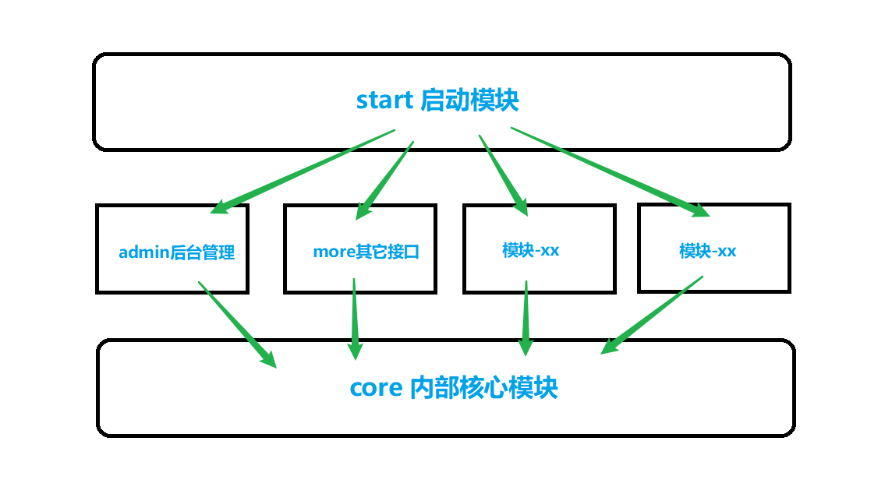

# Maven多模块版本

--- 

maven多模块架构有什么优点？
> 相比于单体项目，maven多模块架构可以将项目中不同业务划分成N个模块，每个模块之间职责清晰，互不干扰，
> 整体形成一个可拔插的架构，让代码更好的践行“高内聚、低耦合”的思想，大大提高了架构的可维护性、可扩展性

### 项目架构

**maven多模块版与单体版代码大体无异，其架构为：**

- **`sp-com`**：父模块
	- **`sp-core`**：核心模块
	- **`sp-admin`**：后台管理相关接口代码
	- **`sp-start`**：启动类模块(整个项目由此启动) 
	- **`sp-more`**：其它模块

**注意事项**

- `sp-core`项目核心模块，其它所有模块都引用这个模块，公共代码都放到这个模块 
- `sp-admin`、`sp-more`等其它自建模块必须依赖`sp-core`核心模块
- `sp-start`是启动模块，此模块依赖其它所有模块 
- 自建模块，可仿照既有格式，如`sp-more`一样新建出`com.pj.project`包来存放代码
- 如何快速创建子模块？拿一个现有模块复制一份，然后删掉ide配置并改一下`pom.xml`项目名字，并配置`父pom.xml`与`start模块pom.xml`，在ide里重新构建项目即可
- 如果开发中一个`表模块`不知道放到哪个模块为好，就放到`sp-more`里，如果该`表模块`需要被其它模块依赖，则放到`sp-core`里
- 模块之间禁止循环依赖！

**模块依赖图示例**

如无必要，请勿改变项目依赖结构 

### 打包步骤
maven多模块打包部署，与单体项目稍微有些不同

1. 在父pom.xml所在文件夹执行cmd命令: `mvn package`
2. 打好包后，进入`sp-start`文件夹的`target`目录下，该目录可以看到`sp-start-0.0.1-SNAPSHOT.jar`与`lib\`依赖目录
3. 此两个文件便是打包后的所有文件，按照单体模式的步骤将此部署到服务器即可，其它的模块不用管

